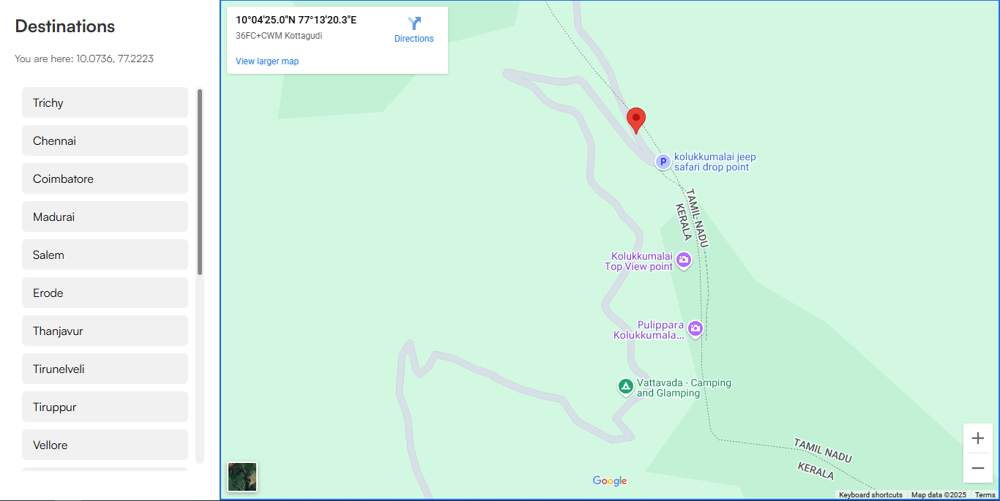

# 📍 Direction-V2 – Virtual Tour Navigation Module

**Direction-V2** is the second iteration of a lightweight, embeddable **direction feature** tailored for **Virtual Tour projects**. It provides a seamless way to display Google Maps routes between curated locations—ideal for tourism, campus navigation, cultural walks, or smart city apps.



---

## 🆕 What's New in V2

- ✨ Cleaner UI and improved mobile responsiveness
- 📌 Easy-to-edit coordinates for quick map updates
- 🔗 Simplified structure for fast integration
- 📷 Visual preview added (screenshot support)
- 🧱 Ideal for use inside React Native WebView or HTML-based apps

---

## 🚀 Features

- 🗺️ Google Maps Embed Integration (Static & Dynamic)
- 🧭 Predefined Route Directions
- 💡 Clean, minimalist design
- 📱 Mobile & touch-friendly
- 🌐 Plug-and-play with any HTML or React frontend

---

## 📂 Folder Structure

```bash
Direction-V2/
├── assets/             # Screenshots, icons
│   └── screenshot.png  # UI preview
├── css/                # Stylesheets
├── js/                 # Map interaction logic (optional)
├── index.html          # Main interface
└── README.md           # Documentation
