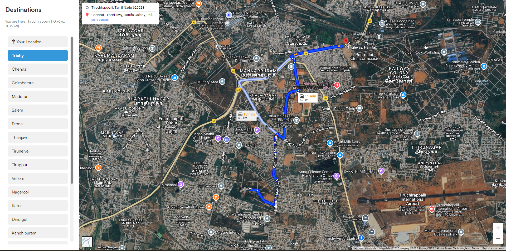

# Directions 🚗🗺️

A simple web application to get user location and show directions to a specific destination using Google Maps, with live user tracking.

## 🌐 Live Demo
👉 [View Project](https://neon-empanada-2d69b6.netlify.app/)

---

## 📸 Screenshots


*Make sure to add a screenshot named `screenshot.png` in your Netlify deployment folder or update this link with the correct image path.*

---

## 🚀 Features
- Get the user's live geolocation.
- Show user location on Google Maps with a marker.
- Display directions from the user’s current location to a predefined destination.
- Seamless user experience with live location updates.
- Virtual tour integration (Gandhigram project).

---

## 🔧 Tech Stack
- **HTML**
- **CSS**
- **JavaScript**
- **Google Maps (via iframe)**

---

## 📂 How to Run Locally
1. Clone the repository:
   ```bash
   git clone https://github.com/thiyo-de/Directions.git
